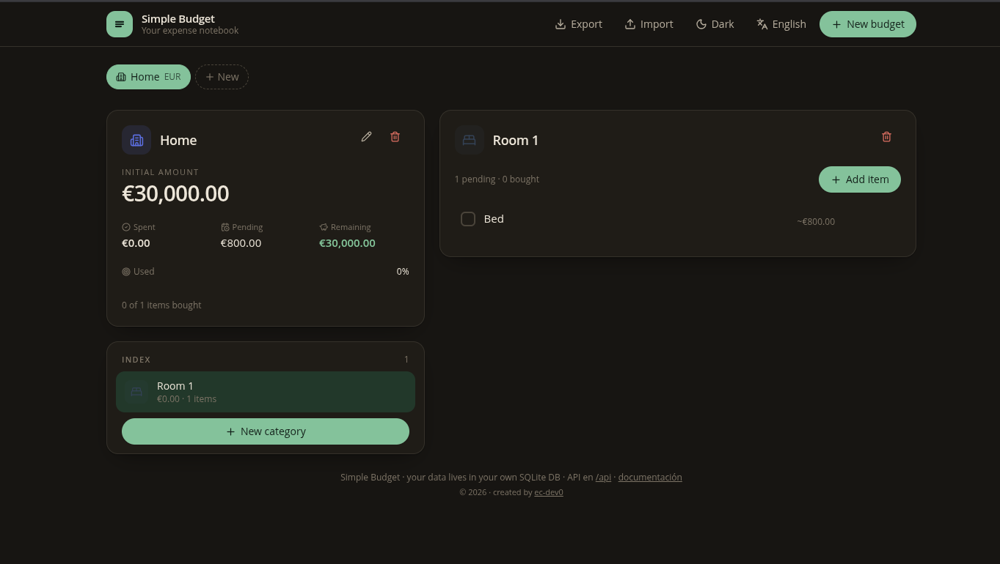

# Simple Budget (documentación en español)

> Tu libreta de gastos. Documentación principal disponible en dos idiomas:
> [English](README.md) · [Contribuir](CONTRIBUTING.md)

[](LICENSE)
[](https://bun.sh)
[](https://sqlite.org)
[](https://svelte.dev)
[](Dockerfile)
[](https://github.com/ec-dev0/simple-budget/pkgs/container/simple-budget)

## Capturas

<p align="center">
  
</p>

> Sustituye `docs/screenshots/preview1.png` por tu captura real cuando la tengas.

## ¿Qué es Simple Budget?

Simple Budget es una pequeña aplicación personal para **controlar un presupuesto** de manera simple y funcional. El flujo es directo:

1. Fijas una **cifra inicial** (p. ej. «Casa», 15 000 €).
2. La organizas en **categorías** con su propio límite (p. ej. «Cocina», 3 000 €).
3. Apuntas cada **artículo** con:
   - **Coste estimado** (lo que piensas gastar).
   - **Coste real** (lo que acabas pagando).
   - Estado **comprado** / **pendiente**.
4. El saldo se calcula solo: gastado, pendiente, restante y porcentaje usado se actualizan en tiempo real al marcar un artículo.

Está pensado para situaciones reales como **equipar una vivienda nueva**, un proyecto personal o cualquier lista de la compra con importe. No quiere ser un sistema financiero completo: la idea es «cuaderno abierto» que se entiende a la primera.

## Características

- **Interfaz bilingüe** (Español / Inglés), elegible al primer arranque y cambiable desde la cabecera.
- **Moneda por presupuesto** (EUR, USD, GBP, …) con **moneda por defecto** definida al onboarding.
- **Tema claro y oscuro** con cambio manual y respeto a la preferencia del sistema operativo.
- **Base de datos SQLite embebida** (`bun:sqlite`) — sin servicios externos, sin Docker compose adicional.
- **API REST completa** y documentada (`docs/API.md`) para integrarla con tus scripts, hojas de cálculo u otro frontend.
- **Exportar / Importar** en formato JSON versionado: para backups, migrar entre instancias o sincronizar.
- **Accesibilidad**: contraste AA en ambos temas, navegación por teclado, etiquetas semánticas.
- **Iconografía Lucide** (MIT) y tipografía **Instrument Sans** (OFL), todo autohospedado.

## Stack

| Capa | Elección | Por qué |
|---|---|---|
| Runtime | Bun ≥ 1.2 | Arranque rápido, soporte TS nativo, SQLite embebido. |
| Backend | Hono | Routing minimalista sobre `Bun.serve` y validación con Zod. |
| Base de datos | `bun:sqlite` | Cero dependencias nativas, archivo único fácil de respaldar. |
| Frontend | Svelte 5 + Vite | Reactividad con *runes* (`$state`, `$derived`), bundles pequeños. |
| Estilos | Tailwind CSS v4 | Utility-first, sin CSS-in-JS, theming con `class="dark"`. |
| Validación | Zod | Mismos esquemas en cliente (formularios) y servidor (entrada). |
| Despliegue | Docker multi-stage sobre `oven/bun` | Imagen única, volumen persistente para la BD. |

## Estructura del repositorio

```
.
├── server/              API REST + capa de datos
│   ├── src/
│   │   ├── db.ts        Conexión SQLite y migraciones versionadas
│   │   ├── repo.ts      Funciones de datos y resúmenes
│   │   ├── api.ts       Rutas REST (Hono + Zod)
│   │   ├── validation.ts Esquemas Zod de entrada
│   │   ├── export.ts    Serialización y carga del formato versionado
│   │   └── index.ts     Entrada: API + sirve la interfaz construida
│   └── data/            Base SQLite (gitignored)
├── web/                 Interfaz Svelte 5
│   ├── src/
│   │   ├── App.svelte         Bootstrap y routing simple
│   │   ├── components/        Componentes de UI
│   │   └── lib/
│   │       ├── api.ts         Cliente HTTP
│   │       ├── store.svelte.ts Estado reactivo (runes)
│   │       ├── theme.svelte.ts Tema claro/oscuro
│   │       ├── format.ts      Helpers de dinero y fechas
│   │       ├── i18n/          Diccionarios ES / EN + store reactivo y helper t()
│   │       ├── types.ts       Tipos compartidos cliente ↔ API
│   │       └── ui.ts          Clases Tailwind reutilizables
│   └── dist/            Build (gitignored)
├── data/                Volumen Docker por defecto (gitignored)
├── docs/
│   └── API.md           Referencia REST completa
├── README.md            Documentación en inglés
├── README.es.md         Este archivo
├── Dockerfile           Build multi-stage
├── docker-compose.yml   Orquestación un solo servicio
└── CONTRIBUTING.md      Guía para contribuciones
```

## Puesta en marcha (desarrollo)

Requisito: [Bun](https://bun.sh) ≥ 1.2.

```bash
bun install            # instala server + web (workspaces)

# terminal 1 — API en :3000
bun run dev:server
# terminal 2 — interfaz en :5173 (proxy a /api)
bun run dev:web
```

Abre `http://localhost:5173`. La primera vez se muestra la pantalla de **onboarding** para elegir idioma y moneda por defecto. Si quieres saltarla y sembrar datos de demostración:

```bash
bun run db:seed
```

### Variables de entorno

| Variable | Defecto | Descripción |
|---|---|---|
| `PORT` | `3000` | Puerto del servidor unificado (API + web estática). |
| `HOST` | `0.0.0.0` | Interfaz de red en la que escuchar. |
| `DB_PATH` | `./data/budget.db` | Ruta del archivo SQLite. |

Ver `.env.example`.

## Producción

```bash
bun run build      # compila la web → web/dist
bun start          # Bun sirve API + web en :3000
```

### Docker

Cada push a `main` publica automáticamente una imagen Docker en **GitHub Container Registry**. Puedes hacer pull y ejecutarla directamente, sin clonar el repositorio:

```bash
docker pull ghcr.io/ec-dev0/simple-budget:latest

docker run -d \
  --name simple-budget \
  --restart unless-stopped \
  -p 3000:3000 \
  -v budget-data:/app/data \
  ghcr.io/ec-dev0/simple-budget:latest
# abrir http://localhost:3000
```

¿Prefieres construir la imagen en local?

```bash
docker build -t simple-budget:local .
GHCR_IMAGE=simple-budget:local docker compose up -d
# abrir http://localhost:3000
```

Para desplegar la imagen publicada, actualízala explícitamente antes de
arrancar el servicio:

```bash
docker compose pull
docker compose up -d
```

La base vive en el volumen `budget-data` (`/app/data/budget.db`). Para hacer backup, basta con copiar ese archivo; para restaurar, sustituirlo y reiniciar el contenedor.

## API REST

La referencia completa (endpoints, cuerpos, respuestas, **códigos de error estables** y ejemplos en `curl` / JavaScript / Python) está en [`API.md`](docs/API.md).

Resumen rápido:

| Método | Ruta | Descripción |
|---|---|---|
| GET | `/api/health` | Estado del servicio |
| GET | `/api/settings` | Preferencias (idioma, moneda, flag de onboarding) |
| PATCH | `/api/settings` | Actualizar preferencias |
| GET | `/api/budgets` | Lista de presupuestos |
| POST | `/api/budgets` | Crear presupuesto |
| GET | `/api/budgets/:id` | Detalle: categorías, artículos y resumen |
| PATCH | `/api/budgets/:id` | Actualizar presupuesto |
| DELETE | `/api/budgets/:id` | Borrar presupuesto (en cascada) |
| GET | `/api/budgets/:id/categories` | Categorías de un presupuesto |
| POST | `/api/budgets/:id/categories` | Crear categoría |
| PATCH | `/api/categories/:id` | Actualizar categoría |
| DELETE | `/api/categories/:id` | Borrar categoría (cascada a artículos) |
| POST | `/api/categories/:id/items` | Crear artículo |
| GET | `/api/items/:id` | Detalle de artículo |
| PATCH | `/api/items/:id` | Actualizar artículo |
| PATCH | `/api/items/:id/purchase` | Marcar comprado / pendiente + coste real |
| DELETE | `/api/items/:id` | Borrar artículo |
| GET | `/api/export` | Descarga todos los datos como JSON versionado |
| POST | `/api/import` | Carga datos desde JSON (respeta IDs, reemplaza coincidencias) |

Los nombres de campos usan **snake_case en las respuestas** (filas de la BD) y **camelCase en los cuerpos de entrada** (`initialAmount`, `estimatedCost`, `actualCost`, `limitAmount`).

### Códigos de error

Las respuestas de error siguen una forma estable:

```json
{
  "error": {
    "code": "ERR_REQUIRED_NAME",
    "message": "El nombre es obligatorio",
    "issues": [{"path": ["name"], "code": "ERR_REQUIRED"}]
  }
}
```

El frontend traduce `code` según el idioma activo. Los códigos actuales están listados en [`API.md`](docs/API.md).

### Copia de seguridad y migración

Los botones **Exportar** / **Importar** de la cabecera generan y consumen un `.json` versionado (`format: "simple-budget/export", version: 1`). Pensado para:

- **Backup rápido**: descarga el archivo de vez en cuando.
- **Migración**: levanta una nueva instancia y volca el último backup.
- **Sincronización**: reimportar el mismo archivo no duplica nada — los registros con IDs coincidentes se actualizan.

### Ejemplo

```bash
# Crear presupuesto
curl -X POST http://localhost:3000/api/budgets \
  -H 'content-type: application/json' \
  -d '{"name":"Casa","initialAmount":15000,"currency":"EUR"}'

# Leer preferencias
curl http://localhost:3000/api/settings
```

## Notas de seguridad

- Simple Budget **no tiene autenticación**: es una app personal y autohospedada. Expónla solo en tu máquina / red local, o detrás de un reverse proxy con auth.
- La API **no envía cabeceras CORS**: una página de otro origen no puede leerla desde el navegador; los scripts y herramientas CLI (`curl`, Python, …) funcionan igual.
- La imagen Docker corre con un **usuario no-root** sobre la base mínima `oven/bun:1-slim`.
- `POST /api/import` rechaza cuerpos de más de **5 MB**.

## Internacionalización

Toda la UI pasa por un módulo `web/src/lib/i18n/` con dos diccionarios completos (`es.ts`, `en.ts`) y un helper `t("clave")` reactivo. Para añadir un idioma nuevo ver [`CONTRIBUTING.md`](CONTRIBUTING.md).

El idioma y la moneda por defecto viven en una **tabla `settings`** dentro de la misma base SQLite. Se actualizan vía `PATCH /api/settings`.

## Verificación

```bash
bun test           # pruebas de la capa de datos y la API
bun run check      # svelte-check (tipos de la web)
bunx tsc --noEmit  # tipos del backend (desde server/)
```

## Licencia

[MIT](LICENSE) — usa, modifica y redistribuye libremente, conservando el aviso de copyright.
